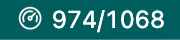
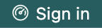

# Augmeter — VS Code Extension

[](https://marketplace.visualstudio.com/items?itemName=kamacode.augmeter)
[](https://marketplace.visualstudio.com/items?itemName=kamacode.augmeter)
[](#privacy--security)
[](LICENSE)

Augment credits/usage meter for the VS Code status bar. Color cues, one‑click refresh, and secure cookie sign‑in.

> Not affiliated with or endorsed by Microsoft. Augmeter is an independent, open‑source utility for users of Augment AI.

---

## Features

- Usage in the status bar
- Color thresholds (no % by default)
- Click to refresh
- Secure cookie sign‑in (VS Code Secrets)
- Auto refresh on focus and interval (1–300s)
- Accessible colors and high‑contrast

### Screenshot



## Installation

### From VS Code Marketplace

- Search “Augmeter” in Extensions and install by publisher “kamacode”, or open: https://marketplace.visualstudio.com/items?itemName=kamacode.augmeter

### Command line

- Stable VS Code:
  - `code --install-extension kamacode.augmeter`
- Insiders:
  - `code-insiders --install-extension kamacode.augmeter`

### Manual (.vsix)

1. Build the package: `npm run package` (generates `augmeter-<version>.vsix`)
2. Install:
   - VS Code: `code --install-extension augmeter-<version>.vsix`
   - VS Code Insiders: `code-insiders --install-extension augmeter-<version>.vsix`

## Quick start

1. Install the extension and reload VS Code.
2. Click the status bar if it shows “Sign in”.

   
3. Your browser opens https://app.augmentcode.com. Copy the `_session` cookie value; Augmeter watches the clipboard and detects it automatically.


4. Once validated, the status bar shows “Connected” and then real usage when available.
5. Click the status bar (default action) to refresh usage on demand.

## Usage

- Status bar states:
  - Sign in: Not authenticated; use “Open Website and Sign In”.
  - Connected: Authenticated, awaiting usage data.
  - Usage: Shows used/remaining/both based on your settings.
- Commands (Command Palette):
  - Augmeter: Refresh Usage (`augmeter.manualRefresh`)
  - Augmeter: Open Settings (`augmeter.openSettings`)
  - Augmeter: Sign In (`augmeter.signIn`)
  - Augmeter: Sign Out (`augmeter.signOut`)

## Configuration

All settings live under `augmeter.*`.

| Setting                      | Type            | Default                               | Description                                             |
| ---------------------------- | --------------- | ------------------------------------- | ------------------------------------------------------- |
| `augmeter.enabled`         | boolean         | `true`                              | Enable/disable the extension                            |
| `augmeter.refreshInterval` | number (1–300) | `60`                                | Poll interval (seconds)                                 |
| `augmeter.clickAction`     | string          | `"refresh"`                         | On click:`refresh`, `openWebsite`, `openSettings` |
| `augmeter.displayMode`     | string          | `"both"`                            | Show `used`, `remaining`, or `both`               |
| `augmeter.apiBaseUrl`      | string          | `"https://app.augmentcode.com/api"` | Augment API base URL                                    |

Example user settings (JSON):

```json
{
  "augmeter.enabled": true,
  "augmeter.refreshInterval": 60,
  "augmeter.displayMode": "both",
  "augmeter.clickAction": "refresh"
}
```

## Requirements

- Visual Studio Code: `>= 1.104.0`
- Node.js: `>= 20.0.0` (development)

Runtime dependencies:

- `undici` (HTTP client)

## Privacy & security

Augmeter respects your VS Code telemetry settings: if telemetry is off, analytics are off.

- `_session` cookie is stored in VS Code Secrets
- Logs redact sensitive values (cookies, headers). See Output → Augmeter
- No PII is sent; analytics are anonymized

## Known issues & troubleshooting

- “Sign in” persists
  - Cookie not detected or invalid. Reopen https://app.augmentcode.com and copy the `_session` cookie again.
- “Connected” but no usage
  - You are authenticated; data fetch will occur shortly or on click. Network/proxy or API availability can delay it.
- 401/unauthenticated in logs
  - Cookie may have expired. Sign out, then sign in again.
- No status bar item
  - Ensure `augmeter.enabled` is `true`. Check the Output channel for errors.

## Contributing

We welcome issues and PRs. Before contributing, please:

1. Fork and clone the repo
2. `npm install`
3. Development
   - Launch Extension Host: Run and Debug → “Run Extension” (uses `npm run watch`)
   - Tests: `npm run test:all` (unit with coverage + integration), or `npm run test:unit`
   - Lint/format: `npm run lint` / `npm run format`
4. Packaging: `npm run package` to produce a `.vsix`

Please follow conventional commit messages and keep changes focused. Open an issue to discuss substantial changes first.

## License

MIT — see [LICENSE](LICENSE).

## Changelog

See GitHub Releases or commit history: https://github.com/markomiric/augmeter/releases
