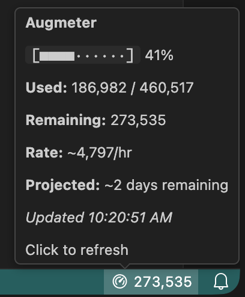
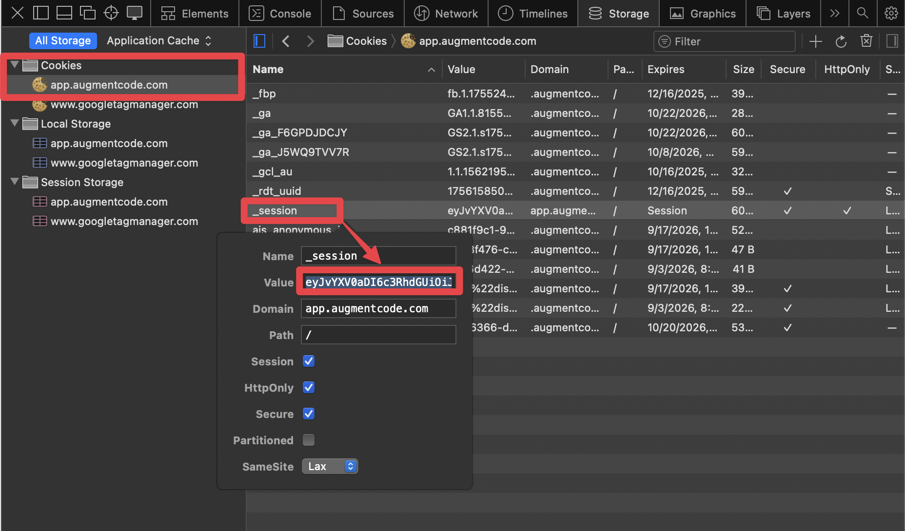

# Augmeter — VS Code Extension

[](https://marketplace.visualstudio.com/items?itemName=kamacode.augmeter)
[](https://marketplace.visualstudio.com/items?itemName=kamacode.augmeter)
[](#privacy--security)
[](LICENSE)

Augment credits/usage meter for the VS Code status bar. Color cues, one-click refresh, and secure cookie sign-in.

> Not affiliated with or endorsed by Microsoft. Augmeter is an independent, open-source utility for users of Augment AI.

---

## Features

- Real-time usage tracking in the status bar
- Rich tooltip with usage bar, rate, projection, and session activity
- Color thresholds that warn as you approach your limit
- Click to refresh
- Secure cookie sign-in (stored in VS Code Secrets)
- Auto-refresh on window focus and configurable interval (1-300s)
- Accessible colors and high-contrast support



## Installation

### From VS Code Marketplace

Search **"Augmeter"** in Extensions and install by publisher **kamacode**, or open:
https://marketplace.visualstudio.com/items?itemName=kamacode.augmeter

### Command line

```sh
# Stable
code --install-extension kamacode.augmeter

# Insiders
code-insiders --install-extension kamacode.augmeter
```

### Manual (.vsix)

1. Build: `npm run package` (produces `augmeter-<version>.vsix`)
2. Install: `code --install-extension augmeter-<version>.vsix`

## Quick start

1. Install the extension and reload VS Code.
2. Click **"Augmeter"** in the status bar.
3. Your browser opens https://app.augmentcode.com. Copy the `_session` cookie value — Augmeter watches the clipboard and detects it automatically.

   

4. Once signed in, the status bar shows a spinner while loading, then your real usage numbers.
5. Click the status bar anytime to refresh.

## Usage

**Status bar states:**

| State      | Status bar                     | What it means                  |
| ---------- | ------------------------------ | ------------------------------ |
| Signed out | `Augmeter` (with icon)         | Not signed in — click to start |
| Loading    | `Augmeter` (with spinner)      | Signed in, fetching your usage |
| Active     | Usage numbers (e.g. `273,535`) | Live usage data                |

**Commands** (Command Palette):

- **Augmeter: Refresh Usage** — fetch latest data now
- **Augmeter: Sign In** — authenticate with your session cookie
- **Augmeter: Sign Out** — clear stored credentials
- **Augmeter: Open Settings** — jump to Augmeter settings

## Configuration

All settings live under `augmeter.*`.

| Setting                     | Type           | Default                             | Description                                                              |
| --------------------------- | -------------- | ----------------------------------- | ------------------------------------------------------------------------ |
| `augmeter.enabled`          | boolean        | `true`                              | Enable/disable the extension                                             |
| `augmeter.refreshInterval`  | number (1-300) | `60`                                | Poll interval in seconds                                                 |
| `augmeter.clickAction`      | string         | `"refresh"`                         | On click: `refresh`, `openWebsite`, `openSettings`                       |
| `augmeter.displayMode`      | string         | `"both"`                            | Show `used`, `remaining`, `remainingOnly`, or `both`                     |
| `augmeter.apiBaseUrl`       | string         | `"https://app.augmentcode.com/api"` | Augment API base URL                                                     |
| `augmeter.statusBarDensity` | string         | `"auto"`                            | Density: `auto`, `compact` (text only), `detailed` (icon + text)         |
| `augmeter.statusBarIcon`    | string         | `"dashboard"`                       | Icon when density is `detailed` (e.g. `dashboard`, `graph`, `pie-chart`) |
| `augmeter.showInStatusBar`  | boolean        | `true`                              | Show Augmeter in the status bar                                          |

Example:

```json
{
  "augmeter.refreshInterval": 60,
  "augmeter.displayMode": "remainingOnly",
  "augmeter.statusBarDensity": "detailed",
  "augmeter.clickAction": "refresh"
}
```

### Display modes

- **used** — `55/100` (used / limit)
- **remaining** — `45/100` (remaining / limit)
- **remainingOnly** — `45` (just the remaining number; tooltip and color cues provide context)
- **both** — `55/100` (same as used)

### Density

- **compact** — text only (no icon in data state)
- **detailed** — icon + text
- **auto** — adaptive

The icon always appears in non-data states (signed out / loading) regardless of density, since it serves as the only visual identity cue.

## Requirements

- VS Code `>= 1.104.0`
- Node.js `>= 20.0.0` (development only)

## Privacy & security

Augmeter respects your VS Code telemetry settings — if telemetry is off, analytics are off.

- Session cookie stored in VS Code Secrets (encrypted)
- Logs redact sensitive values (cookies, headers) — see Output > Augmeter
- No PII is sent; analytics are anonymized

## Known issues & troubleshooting

- **"Augmeter" with no data** — Cookie not detected or invalid. Visit https://app.augmentcode.com and copy the `_session` cookie again.
- **Spinner persists** — You are authenticated but data hasn't arrived yet. Click to refresh, or check your network/proxy.
- **401 in logs** — Cookie may have expired. Sign out and sign in again.
- **No status bar item** — Check that `augmeter.enabled` is `true` and look at the Output channel for errors.

## Contributing

1. Fork and clone the repo
2. `npm install`
3. Development:
   - Run and Debug > "Run Extension" (uses `npm run watch`)
   - Tests: `npm run test:all` (unit + integration) or `npm run test:unit`
   - Lint/format: `npm run lint` / `npm run format`
4. Package: `npm run package` (produces a `.vsix`)

Please follow conventional commit messages and keep changes focused. Open an issue first to discuss substantial changes.

## Releasing

Releases are automated via GitHub Actions. Pushing a `vX.Y.Z` tag triggers the workflow, which lints, tests, packages a `.vsix`, creates a GitHub Release, and (if `VSCE_PAT` is configured) publishes to the VS Code Marketplace.

### Steps

1. **Bump version** (do not create a git tag yet):
   ```sh
   npm version patch --no-git-tag-version
   # or: npm version minor --no-git-tag-version
   ```
2. **Update `CHANGELOG.md`** with the new version and changes.
3. **Commit and tag**:
   ```sh
   git add package.json package-lock.json CHANGELOG.md
   git commit -m "Release vX.Y.Z"
   git tag vX.Y.Z
   git push origin main --tags
   ```
4. The release workflow handles the rest.

### What happens automatically

- Linting and tests run
- Tag is verified against `package.json` version
- `.vsix` artifact is built and uploaded
- GitHub Release is created with the `.vsix` attached
- If `VSCE_PAT` secret is set, the extension is published to the VS Code Marketplace

### Troubleshooting

| Problem                              | Fix                                                                                                                              |
| ------------------------------------ | -------------------------------------------------------------------------------------------------------------------------------- |
| **Tag/version mismatch**             | `package.json` version must match the tag (e.g. tag `v1.2.3` requires version `1.2.3`). Delete the tag, fix the version, re-tag. |
| **Expired PAT**                      | Rotate the Azure DevOps PAT, update the `VSCE_PAT` secret in GitHub, and re-run the workflow.                                    |
| **Duplicate version on Marketplace** | The publish step uses `--skip-duplicate` and will succeed without re-publishing. Bump the version for new changes.               |

### Manual fallback

If the automated publish fails, download the `.vsix` from the GitHub Release and upload it manually at https://marketplace.visualstudio.com/manage/publishers/kamacode.

## License

MIT — see [LICENSE](LICENSE).

## Changelog

See [GitHub Releases](https://github.com/markomiric/augmeter/releases).
