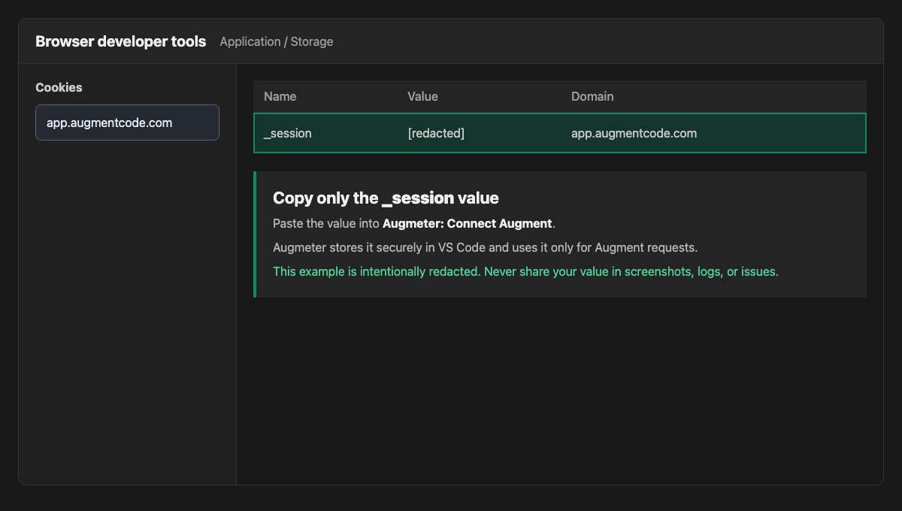

# Augmeter: Assistant Usage for VS Code

[](https://marketplace.visualstudio.com/items?itemName=kamacode.augmeter)
[](https://marketplace.visualstudio.com/items?itemName=kamacode.augmeter)
[](#data-sources-and-privacy)
[](LICENSE)

See coding-assistant activity and connected provider usage in one VS Code view.

Augmeter reads local Claude Code, Codex, and GitHub Copilot activity, with optional Augment credit data.

| Assistant          | What Augmeter shows                                                | Source                              |
| ------------------ | ------------------------------------------------------------------ | ----------------------------------- |
| **Claude Code**    | Local user turns for 5-hour and 7-day windows                      | `~/.claude/projects` logs           |
| **Codex**          | Local user turns for 5-hour and 7-day windows                      | `~/.codex/sessions` logs            |
| **GitHub Copilot** | Cumulative local requests, or official premium requests by month   | VS Code data or the GitHub API      |
| **Augment**        | Credit balance and, when available, cycle usage, renewal, and pace | Auggie CLI or secure session cookie |

Local activity counts are signals, not provider quotas. Claude Code, Codex, and local Copilot activity stays on this machine. Augmeter contacts Augment for credit data and contacts GitHub only when Copilot API tracking is enabled.

Claude Code and Codex counts exclude tool results, metadata, and agent/subagent sessions. The local Copilot counter is cumulative because VS Code does not provide a reliable time window for it.

> Augmeter is independent and open source. It is not affiliated with or endorsed by Augment, Anthropic, OpenAI, GitHub, or Microsoft. Product names are trademarks of their respective owners.


The screenshot uses illustrative values and contains no user data or credentials.

See [Understanding assistant usage data](docs/usage-data.md) for the exact source and limitations of every number.

## Install

[Install Augmeter from the VS Code Marketplace](https://marketplace.visualstudio.com/items?itemName=kamacode.augmeter), or search for **Augmeter** in the VS Code Extensions view.

## Getting started

### Assistant activity

Local Claude Code, Codex, and GitHub Copilot tracking starts automatically when the workspace is trusted. No separate account sign-in is required.

- Use `augmeter.providers.enabledIds` to choose assistants.
- Local Copilot counting requires `sqlite3` on your `PATH`. You can instead enable official GitHub API data in `augmeter.providers.copilot.api.enabled`.
- Local file and VS Code database reading is off in untrusted workspaces.

### Augment credits

Run **Augmeter: Connect Augment**. Clicking the disconnected status-bar item opens Assistant Usage, where the connection step is explained.

If Auggie CLI is installed and already connected, Augmeter reads `auggie account status`. No additional Augment sign-in is required, and Augmeter never reads CLI credentials.

Current Auggie CLI output reports a remaining balance and monthly allowance, but not exact cycle consumption. Augmeter labels that data as balance-only and does not infer `0 used`, a percentage, pace, or trends. Exact cycle metrics appear only when the connected source supplies them.

```sh
npm install -g @augmentcode/auggie
auggie login
```

If VS Code cannot find an installed CLI, set `augmeter.auggieCli.path` to its full path.

#### Session-cookie fallback

When Auggie CLI is unavailable, Augmeter can use your Augment `_session` cookie:

1. Run **Augmeter: Connect Augment**.
2. Sign in at [app.augmentcode.com](https://app.augmentcode.com).
3. In browser developer tools, open Application or Storage, then Cookies.
4. Copy the value of `_session`.
5. Paste it into Augmeter if clipboard detection has not already completed the connection.



The cookie is stored in VS Code SecretStorage and used only for Augment requests. Augmeter watches the clipboard only during the connection step. Choose `auto`, `auggie-cli`, or `cookie` with `augmeter.dataSource`.

Treat `_session` as a credential: never paste it into an issue, log, screenshot, or exported diagnostic. If it is exposed, sign out of Augment to invalidate the session before connecting again.

## Usage

The status bar labels Augment credit values when connected. Its tooltip and the Assistant usage view put local assistant activity first, whether or not Augment is connected.

| Augment state | Status bar                | Next action                          |
| ------------- | ------------------------- | ------------------------------------ |
| Disconnected  | `Augmeter`                | Click to open Assistant usage        |
| Loading       | `Augmeter` with a spinner | Wait or click later to refresh       |
| Connected     | Labeled Augment values    | Click to refresh, open, or configure |

### Commands

- **Augmeter: Refresh Assistant Activity and Credits** updates every enabled source.
- **Augmeter: Connect Augment** reads credits through Auggie CLI or a session cookie.
- **Augmeter: Disconnect Augment** removes Augmeter's connection. It does not sign out Auggie CLI.
- **Augmeter: Copy Augment Credit Summary** copies the current Augment balance and pace.
- **Augmeter: Open Assistant Usage** opens local assistant activity and connected provider usage.
- **Augmeter: Export Augment Credit History (CSV)** exports local Augment snapshots.
- **Augmeter: Export All Usage Data (JSON)** exports credits, assistant activity, health states, and relevant settings.
- **Augmeter: Copy Diagnostics** copies redacted support information.
- **Augmeter: Open Settings** opens all Augmeter settings.

## Configuration

All settings live under `augmeter.*` in VS Code Settings. These are the most common controls:

| Setting                          | Default                      | What it controls                                      |
| -------------------------------- | ---------------------------- | ----------------------------------------------------- |
| `enabled`                        | `true`                       | All Augmeter collection and display                   |
| `refreshInterval`                | `60` seconds                 | Refresh interval while VS Code is focused             |
| `clickAction`                    | `refresh`                    | Status-bar click behavior                             |
| `providers.enabled`              | `true`                       | Local assistant activity tracking                     |
| `providers.enabledIds`           | `claude`, `codex`, `copilot` | Assistants included in local tracking                 |
| `providers.copilot.api.enabled`  | `false`                      | Official Copilot premium-request usage                |
| `providers.copilot.api.username` | empty                        | GitHub account used for official Copilot data         |
| `budget.cycleTarget`             | `0`                          | Personal target for the current Augment billing cycle |
| `history.retentionDays`          | `35`                         | Local credit history kept for trends and CSV export   |

The status bar uses one consistent presentation: current Augment cycle usage, credits left, and native VS Code warning colors. The tooltip and Assistant Usage view provide the detailed breakdown.

## Data sources and privacy

- Augment credit requests use Auggie CLI or the Augment API.
- Session cookies are stored in VS Code SecretStorage and redacted from logs.
- Claude Code and Codex user-turn counts come from local session logs; tool results, metadata, and Claude Code/Codex agent/subagent sessions are excluded.
- Local Copilot activity is a cumulative counter from VS Code's database through a fixed, read-only `sqlite3` query. VS Code does not expose a reliable time window for this counter.
- Optional official Copilot data reads `GITHUB_TOKEN` from the extension host environment. The token is not persisted by Augmeter.
- Credit history, assistant activity, and diagnostics remain local unless you export or paste them.
- Augmeter does not send extension analytics or telemetry events.
- Local file and database reading is disabled in untrusted workspaces.

For counting rules, freshness semantics, and a source-by-source explanation of the dashboard, see [Understanding assistant usage data](docs/usage-data.md).

Augmeter ships with zero runtime package dependencies. It can invoke the existing `auggie` and `sqlite3` binaries for the sources described above. See [SECURITY.md](SECURITY.md) for the subprocess, secret, and Workspace Trust model.

## Requirements

- VS Code `>= 1.104.0`
- `sqlite3` on `PATH` for local GitHub Copilot counts
- Node.js `>= 20.18.0` for development only

## Troubleshooting

- **Augment credits not connected:** Run **Augmeter: Connect Augment**. If a saved cookie expired, copy a fresh `_session` value.
- **Augment credits keep loading:** Run **Refresh Assistant Activity and Credits**, then check your network and Output > Augmeter.
- **No Claude Code or Codex activity:** Confirm the configured path contains session logs and the workspace is trusted.
- **No local Copilot activity:** Install `sqlite3`, confirm GitHub Copilot has recorded requests, and check `providers.copilot.stateDbPath` only if VS Code data is stored in a custom location.
- **No status-bar item:** Check `augmeter.enabled` and `augmeter.showInStatusBar`, then review Output > Augmeter.

## Contributing

1. Fork and clone the repo
2. `npm install`
3. Development:
   - Run and Debug > "Run Extension" (uses `npm run watch`)
   - Tests: `npm run test:all` (unit + integration) or `npm run test:unit`
   - Lint/format: `npm run lint` / `npm run format`
4. Package: `npm run package` (produces a `.vsix`)

### Testing conventions

- **Unit tests** live in `src/unit/` as `*.unit.test.ts`, run by Vitest in a Node environment with the VS Code API mocked (`test-setup/vitest-setup.ts`).
- **Integration tests** live in `src/test/suite/` as `*.test.ts`, run in a real extension host via `@vscode/test-cli` (configured in `.vscode-test.mjs`, compiled with `tsconfig.test.json`).

Please follow conventional commit messages and keep changes focused. Open an issue first to discuss substantial changes.

## Releasing

Releases are automated via GitHub Actions. Pushing a `vX.Y.Z` tag triggers the workflow, which lints, tests, packages a `.vsix`, creates a GitHub Release, and (if `VSCE_PAT` is configured) publishes to the VS Code Marketplace.

### Steps

1. **Bump version** (do not create a git tag yet):
   ```sh
   npm version patch --no-git-tag-version
   # or: npm version minor --no-git-tag-version
   ```
2. **Update `CHANGELOG.md`** with the new version and changes.
3. **Commit and tag**:
   ```sh
   git add package.json package-lock.json CHANGELOG.md
   git commit -m "Release vX.Y.Z"
   git tag vX.Y.Z
   git push origin main --tags
   ```
4. The release workflow handles the rest.

### What happens automatically

- Linting and tests run
- Tag is verified against `package.json` version
- `.vsix` artifact is built and uploaded
- GitHub Release is created with the `.vsix` attached
- If `VSCE_PAT` secret is set, the extension is published to the VS Code Marketplace

### Troubleshooting

| Problem                              | Fix                                                                                                                              |
| ------------------------------------ | -------------------------------------------------------------------------------------------------------------------------------- |
| **Tag/version mismatch**             | `package.json` version must match the tag (e.g. tag `v1.2.3` requires version `1.2.3`). Delete the tag, fix the version, re-tag. |
| **Expired PAT**                      | Rotate the Azure DevOps PAT, update the `VSCE_PAT` secret in GitHub, and re-run the workflow.                                    |
| **Duplicate version on Marketplace** | The publish step uses `--skip-duplicate` and will succeed without re-publishing. Bump the version for new changes.               |

### Manual fallback

If the automated publish fails, download the `.vsix` from the GitHub Release and upload it manually at https://marketplace.visualstudio.com/manage/publishers/kamacode.

## License

MIT. See [LICENSE](LICENSE).

## Changelog

See [GitHub Releases](https://github.com/markomiric/augmeter/releases).
