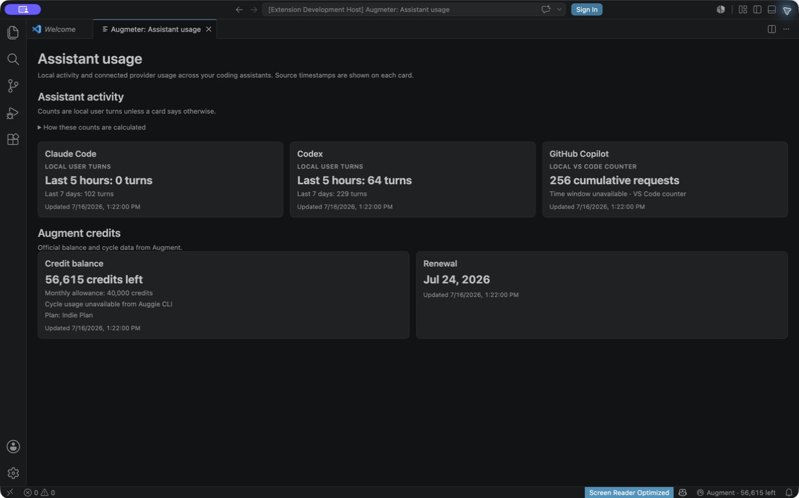
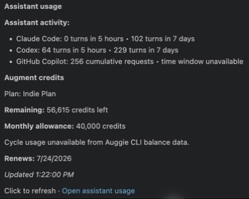

# Understanding assistant usage data

Augmeter combines local coding-assistant activity with connected provider data. The cards deliberately use different labels because the underlying sources measure different things.

The screenshot is a live verification snapshot from July 16, 2026. Its values will change as local logs and provider balances change.

## What each number means

| Card           | Value                                                        | Source                                                         | Important limitations                                                                                                                                                       |
| -------------- | ------------------------------------------------------------ | -------------------------------------------------------------- | --------------------------------------------------------------------------------------------------------------------------------------------------------------------------- |
| Claude Code    | User turns in rolling 5-hour and 7-day windows               | JSONL files under `~/.claude/projects`                         | Excludes tool results, metadata, and `subagents` directories. This is an activity signal, not an Anthropic quota.                                                           |
| Codex          | User turns in rolling 5-hour and 7-day windows               | JSONL files under `~/.codex/sessions`                          | Counts root `event_msg` / `user_message` records and excludes sessions marked as subagents. This is an activity signal, not an OpenAI quota.                                |
| GitHub Copilot | Cumulative requests recorded by VS Code                      | `languageModelStats.copilot-*` rows in VS Code's `state.vscdb` | VS Code does not attach a reliable time window, so Augmeter does not label this value as daily, weekly, or monthly.                                                         |
| Augment        | Remaining credits, monthly allowance, plan, and renewal date | `auggie account status`, or the Augment API when configured    | Current Auggie CLI output does not report exact cycle consumption. Augmeter therefore withholds percent used, pace, target progress, and trends for balance-only responses. |

## Why Augment may show more remaining than the monthly allowance

Rollover credits can make the remaining balance larger than the monthly allowance. These are separate values:

- **Remaining credits** is the exact balance reported by Auggie.
- **Monthly allowance** is the plan's regular monthly allocation.
- **Cycle usage** is shown only when the source reports enough information to calculate it reliably.

Augmeter does not infer `0 used` from a balance-only response. It also shows the renewal date without deriving a day countdown because Auggie provides a calendar date, not an exact renewal time.

## Freshness

Each card's **Updated** timestamp is when Augmeter last collected that source. It is not the time the dashboard webview happened to open, and it does not imply that a provider event occurred at that exact moment.

## Status tooltip

The tooltip uses the same definitions as the dashboard: Claude Code and Codex are local user turns, Copilot is a cumulative counter without a known time window, and balance-only Augment data never produces an invented percentage or pace.

## Verification paths

The production counting logic lives in:

- [`claude-provider-adapter.ts`](../src/providers/adapters/claude-provider-adapter.ts)
- [`codex-provider-adapter.ts`](../src/providers/adapters/codex-provider-adapter.ts)
- [`copilot-provider-adapter.ts`](../src/providers/adapters/copilot-provider-adapter.ts)
- [`auggie-cli-source.ts`](../src/services/auggie-cli-source.ts)
- [`usage-dashboard.ts`](../src/ui/usage-dashboard.ts)

Regression coverage for these semantics lives in the corresponding files under [`src/unit`](../src/unit).
